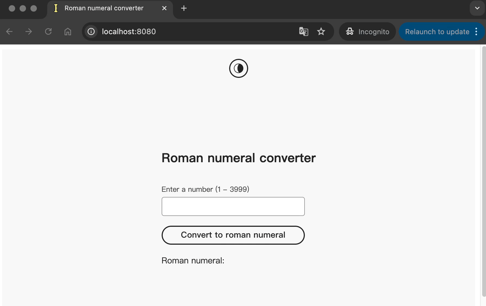

# Roman Numeral Converter

A modern web application that converts Arabic numbers to Roman numerals, supporting both light and dark mode.
Built with React, Adobe React Spectrum and Next.js.

## Features

- Converting Arabic numbers to Roman numerals (from 1 - 3999).
- Light and dark mode.
- Responsive layout.
- Validation and error handling.

## Installation

This project requires NodeJS and NPM. To make sure you have them available on your machine, you can check by following command.

```sh
$ npm -v && node -v
# -> 10.9.2
# -> v22.13.1
```

You should see two versions printed.

Clone this repo on your machine:

```sh
$ git clone https://github.com/txhu-ca/Roman-Numeral.git
$ cd Roman-Numeral
```

To install and set up the library, run:

```sh
$ npm install -S package.json
```

Run app in your machine:

```sh
$ npm run dev # development
$ npm run build && npm run start # production
```

Running tests:

```sh
$ npm test
$ npx playwright test # for e2e tests
```

## Packaging layout

`src/app`: Source code for frontend

`src/app/__tests__`: Tests for frontend

`src/app/romannumeral`: backend API

`src/app/romannumeral/__tests__`: Tests for backend

`e2e-tests`: E2E tests for app

## Technologies Used

### Frontend

- React: my favorite and most familiar framework for modern web application.
- Adobe React Spectrum: recommended design system in assessment. Clear docs available, powerful and easy to use.

### Backend

- Next.js: Easy to bootstrap with smaller projects.

### Testing

- Backend unit test: [Jest](https://jestjs.io/). Verify backend functions act as expected.
- Frontend component test: Jest + [React testing library](https://github.com/testing-library/react-testing-library). Verify React components render properly.
- E2E test: [playwright](https://playwright.dev/). Testing end-to-end user flow including invalid inputs.

## Demo


